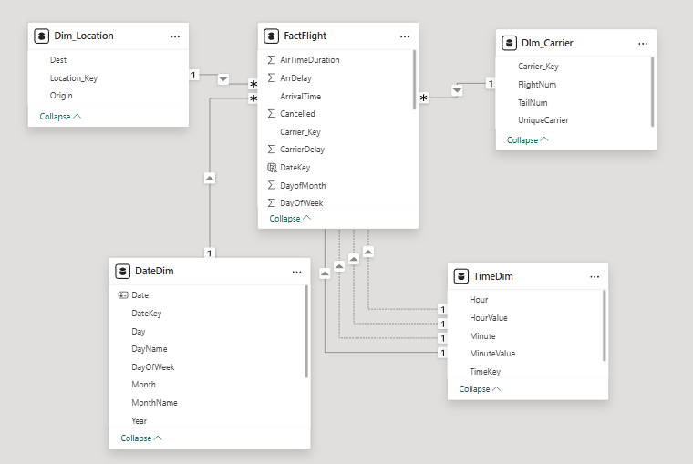

Airline Delay Dashboard ✈️
An interactive Power BI dashboard analyzing flight delays, cancellations, and diversions using data from the U.S. Department of Transportation. This project applies dimensional modeling, DAX measures, and Python-based data cleaning to provide insight into airline performance.
🔍 Project Overview
This dashboard analyzes airline delay data to identify patterns, causes, and trends across carriers, airports, and time periods. The analysis helps stakeholders understand:

Key factors contributing to flight delays
Performance metrics across different airlines
Seasonal patterns in flight delays
Airport-specific delay characteristics

🔧 Features

Dimensional star schema model built with Power Query (M language)
Cleaned raw data in Python
Custom DAX measures for delay breakdowns and KPIs
Interactive Power BI visualizations with drill-down capabilities
Analysis of delay causes (weather, security, NAS, late aircraft)
Geographical and carrier-based performance metrics

📊 Dashboard Preview

The dashboard includes:

Summary KPIs (Total Flights, Average Departure Delay, On-Time Arrivals)
Average Departure Delay by Month
Total Distance by Month and Origin
Flights by Carrier Analysis
Delay Type Breakdown by Origin Airport
Actual vs. Estimated Time Comparison

📐 Data Model

The solution utilizes a star schema with:

FactFlight: Central fact table containing metrics like AirTimeDuration, ArrDelay, and Cancelled
Dim_Location: Airport details including Origin and Destination
Dim_Carrier: Airline carrier information
DateDim: Date-related dimensions with hierarchies
TimeDim: Time-related dimensions for granular analysis

## 📁 Dataset Source
Data from [BTS TranStats](https://www.kaggle.com/datasets/giovamata/airlinedelaycauses?select=DelayedFlights.csv)
The dataset contains information tracked by the U.S. Department of Transportation's (DOT) Bureau of Transportation Statistics (BTS) on the on-time performance of domestic flights operated by large air carriers, including details on delays, cancellations, and diversions.

🛠 Technologies

Python: Data cleaning and preprocessing
Power BI: Dashboard creation, data modeling, and visualization
Power Query (M): ETL processes and data transformation
DAX: Custom measures and calculations
Dimensional Modeling: Star schema design
Git & GitHub: Version control and project management

📊 Key Insights

Average departure delay across all flights: 54.94 minutes
Total flights analyzed: 55K
On-time arrivals: 17K flights
Seasonal variance in flight delays with peaks in months 6-7
JFK shows the highest total distance traveled among origin airports
B6 carrier operates the majority of flights in the dataset

📂 Repository Structure

Airline_Delay_Dashboard.pbix: Main Power BI dashboard file
scripts/: Python data cleaning and preprocessing scripts
images/: Dashboard and data model screenshots

🚀 Getting Started

Clone this repository
Install required Python packages: pip install -r requirements.txt
Run data preprocessing scripts in the scripts/ folder
Open the Power BI dashboard file
Refresh data connections if needed

🤝 Contributing
Contributions are welcome! Please feel free to submit a Pull Request.
