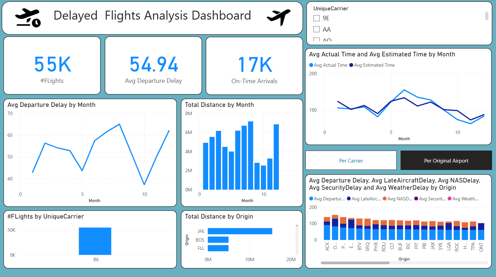

# Airline Delay Dashboard ✈️

An interactive Power BI dashboard analyzing flight delays, cancellations, and diversions using data from the U.S. Department of Transportation. This project applies dimensional modeling, DAX measures, and Python-based data cleaning to provide insight into airline performance.

## 🔧 Features
- Dimensional model built with Power Query (M language)
- Cleaned raw data in Python
- Custom DAX measures for delay breakdowns and KPIs
- Interactive Power BI visualizations

## 📊 Preview

## 📁 Dataset Source
Data from [BTS TranStats](https://www.transtats.bts.gov/OT_Delay/OT_DelayCause1.asp)

## 🛠 Technologies
- Python
- Power BI (Power Query, DAX)
- Dimensional Modeling
- Git & GitHub

## 📂 Folder Structure
- `Dashboard.pbix`: Main Power BI dashboard file
- `scripts/`: Data cleaning scripts
- `data/`: Raw or sample data used
- `images/`: Screenshots
